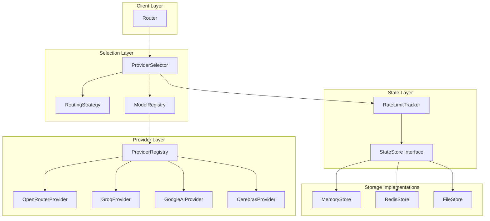
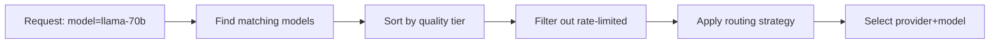
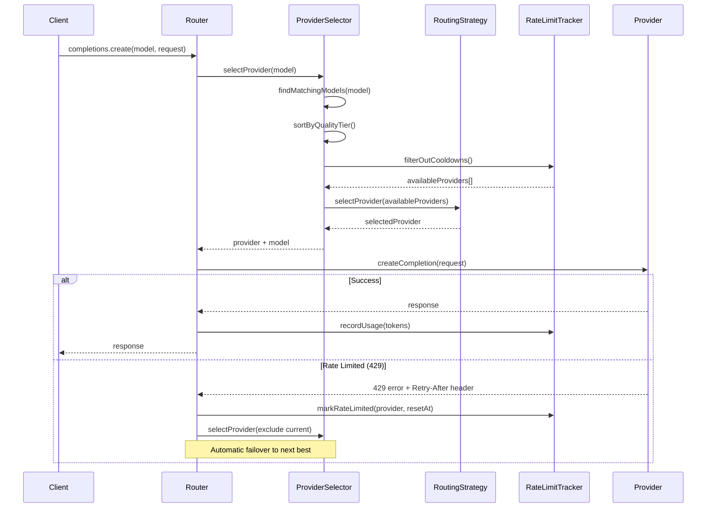

# Free Tier Router - Architecture Design

## Overview

A TypeScript library that abstracts multiple free-tier LLM providers behind a unified OpenAI-compatible interface, with intelligent routing based on rate limits, priorities, and configurable strategies.

## Core Architecture




## Key Components

### 1. Router (Entry Point)

- Exposes OpenAI-compatible `chat.completions.create()` API
- Supports both streaming (SSE) and non-streaming responses
- Handles retries and provider failover transparently

### 2. Provider Interface

```typescript
interface Provider {
  name: string;
  models: ModelConfig[];
  createCompletion(request: CompletionRequest): Promise<CompletionResponse>;
  createCompletionStream(request: CompletionRequest): AsyncIterable<CompletionChunk>;
}

interface ModelConfig {
  id: string;               // e.g., "llama-3.3-70b"
  aliases?: string[];       // e.g., ["llama-3.3-70b-versatile"]
  qualityTier: ModelQualityTier;  // Model quality ranking
  limits: RateLimits;
}

// Model quality tiers (higher = better)
enum ModelQualityTier {
  TIER_1 = 1,  // Small models: 1-8B params (Llama 3.1 8B, Gemma 7B)
  TIER_2 = 2,  // Medium models: 9-35B params (Qwen 32B, Gemma 27B)
  TIER_3 = 3,  // Large models: 36-100B params (Llama 3.3 70B)
  TIER_4 = 4,  // XL models: 100B+ params (Llama 3.1 405B)
  TIER_5 = 5,  // Frontier models: Best reasoning (DeepSeek R1, GPT-4o class)
}

interface RateLimits {
  requestsPerMinute?: number;
  requestsPerHour?: number;
  requestsPerDay?: number;
  tokensPerMinute?: number;
  tokensPerHour?: number;
  tokensPerDay?: number;
}
```

### 3. RateLimitTracker

- Tracks usage across multiple time windows (minute, hour, day)
- Uses sliding window algorithm for accurate limit tracking
- Persists state through pluggable `StateStore` interface
- **Cooldown mechanism**: Marks providers as unavailable on 429 until reset time

```typescript
interface RateLimitTracker {
  recordUsage(provider: string, model: string, tokens: number): Promise<void>;
  getAvailableQuota(provider: string, model: string): Promise<QuotaStatus>;
  canMakeRequest(provider: string, model: string, estimatedTokens?: number): Promise<boolean>;
  markRateLimited(provider: string, model: string, resetAt: Date): Promise<void>;
  isInCooldown(provider: string, model: string): Promise<boolean>;
}

interface QuotaStatus {
  requestsRemaining: { minute: number; hour: number; day: number };
  tokensRemaining: { minute: number; hour: number; day: number };
  resetTimes: { minute: Date; hour: Date; day: Date };
  cooldownUntil?: Date;  // Set when 429 received
}
```

### 4. Token Estimation

Simple heuristic for estimating tokens before making requests:

```typescript
function estimateTokens(text: string): number {
  // ~4 characters per token is a reasonable approximation
  return Math.ceil(text.length / 4);
}
```

### 5. StateStore Interface (Pluggable Persistence)

```typescript
interface StateStore {
  get(key: string): Promise<UsageRecord | null>;
  set(key: string, value: UsageRecord, ttl?: number): Promise<void>;
  increment(key: string, amount: number, ttl?: number): Promise<number>;
}
```

## Model-First Routing

The router uses a **model-quality-first** approach:

1. **User requests a model** (e.g., `llama-3.3-70b` or generic `best-large`)
2. **Find all providers** that offer this model (or equivalent quality tier)
3. **Sort by model quality tier** (highest first)
4. **Within same tier**, apply the selected routing strategy




### Example: User requests `llama-3.3-70b`

Available providers with matching models:

- Groq: `llama-3.3-70b-versatile` (Tier 3) - 60% quota remaining
- Cerebras: `llama-3.3-70b` (Tier 3) - 80% quota remaining  
- OpenRouter: `llama-3.3-70b-instruct` (Tier 3) - 40% quota remaining

With **Priority strategy**: Route to highest priority provider among Tier 3 options
With **Least Used strategy**: Route to Cerebras (80% remaining)

### Generic Model Requests

Users can request generic model tiers:

- `best` → Highest available tier across all providers
- `best-large` → Best 70B+ class model
- `best-medium` → Best 27-35B class model
- `best-small` → Best 7-8B class model
- `best-reasoning` → Best reasoning model (DeepSeek R1, etc.)

## Routing Strategies

The library supports multiple routing strategies through a Strategy pattern:

### Strategy 1: Priority Fallback (Recommended Default)

- Uses providers in configured priority order
- Falls back to next provider when current is rate-limited
- Best for: Predictable behavior, preferred providers

```
Priority: [Groq, Cerebras, OpenRouter, Google]
         └─ Try first ─────────────────────────┘
              └─ On rate limit, try next ──────┘
```

### Strategy 2: Weighted Distribution

- Distributes requests based on remaining quota percentage
- Prevents any single provider from being exhausted too quickly
- Best for: Maximizing total throughput over time

```
Provider A: 80% quota remaining → 40% of requests
Provider B: 60% quota remaining → 30% of requests
Provider C: 40% quota remaining → 20% of requests
Provider D: 20% quota remaining → 10% of requests
```

### Strategy 3: Least Used

- Routes to provider with highest remaining quota
- Maximizes time before any provider is exhausted
- Best for: Avoiding rate limits as long as possible

### Strategy 4: Latency Aware

- Tracks response times and prefers faster providers
- Falls back to slower providers only when faster ones are rate-limited
- Best for: Minimizing response latency

### Strategy 5: Cost Optimized

- Distinguishes between "truly free" and "trial credit" providers
- Exhausts free providers before using trial credits
- Best for: Preserving trial credits for emergencies

### Strategy Interface

```typescript
interface RoutingStrategy {
  name: string;
  selectProvider(
    request: CompletionRequest,
    candidates: ProviderModelCandidate[],
    context: RoutingContext
  ): Promise<ProviderModelCandidate | null>;
}

interface ProviderModelCandidate {
  provider: Provider;
  model: ModelConfig;
  quota: QuotaStatus;
  priority: number;          // User-configured provider priority
  qualityTier: ModelQualityTier;  // Model quality (already sorted)
  latencyMs?: number;        // Historical average latency
  isFreeCredits?: boolean;   // true = trial credits, false = truly free
}
```

## Request Flow




### 429 Rate Limit Handling

When a provider returns 429:

1. Parse `Retry-After` header (or use default 60s if missing)
2. Mark provider+model as in cooldown until reset time
3. Immediately retry with next available provider (no delay)
4. Provider automatically becomes available again after cooldown expires

## Configuration

```typescript
interface FreeTierRouterConfig {
  providers: ProviderConfig[];
  strategy: 'priority' | 'weighted' | 'least-used' | 'latency-aware' | 'cost-optimized';
  stateStore?: StateStore;  // defaults to MemoryStore
  retryConfig?: {
    maxRetries: number;
    backoffMs: number;
  };
  modelAliases?: Record<string, string>;  // map generic names to provider models
}

interface ProviderConfig {
  type: 'openrouter' | 'groq' | 'google' | 'cerebras' | 'cloudflare' | 'github';
  apiKey: string;
  priority?: number;
  enabled?: boolean;
  isFreeCredits?: boolean;  // true = trial credits, false = truly free
}
```

## Project Structure

```
src/
├── index.ts                    # Public API exports
├── router.ts                   # Main Router class
├── providers/
│   ├── base.ts                 # Provider interface & base class
│   ├── openrouter.ts
│   ├── groq.ts
│   ├── google.ts
│   ├── cerebras.ts
│   ├── cloudflare.ts
│   └── registry.ts             # Provider registry
├── models/
│   ├── registry.ts             # Model registry with quality tiers
│   ├── aliases.ts              # Model name aliases and mappings
│   └── tiers.ts                # Quality tier definitions and rankings
├── strategies/
│   ├── base.ts                 # Strategy interface
│   ├── priority.ts
│   ├── weighted.ts
│   ├── least-used.ts
│   ├── latency-aware.ts
│   └── cost-optimized.ts
├── rate-limit/
│   ├── tracker.ts              # RateLimitTracker implementation
│   ├── sliding-window.ts       # Sliding window algorithm
│   ├── cooldown.ts             # Cooldown management for 429s
│   └── limits.ts               # Default limits from free-llm-api-resources
├── state/
│   ├── interface.ts            # StateStore interface
│   ├── memory.ts
│   ├── redis.ts
│   └── file.ts
├── types/
│   ├── openai.ts               # OpenAI-compatible types
│   ├── config.ts
│   └── errors.ts
└── utils/
    ├── tokens.ts               # Token estimation heuristic
    ├── retry.ts
    └── stream.ts               # SSE streaming utilities
```

## Model Registry

The model registry maintains:

- **Quality tier mappings** for all known models across providers
- **Alias mappings** to normalize model names (e.g., `llama-3.3-70b-versatile` → `llama-3.3-70b`)
- **Generic model mappings** (e.g., `best-large` → list of Tier 3+ models)

```typescript
// Example model registry entries
const MODEL_REGISTRY = {
  'llama-3.3-70b': {
    qualityTier: ModelQualityTier.TIER_3,
    aliases: ['llama-3.3-70b-versatile', 'llama-3.3-70b-instruct', 'meta-llama/llama-3.3-70b'],
    providers: ['groq', 'cerebras', 'openrouter', 'cloudflare']
  },
  'deepseek-r1': {
    qualityTier: ModelQualityTier.TIER_5,
    aliases: ['deepseek-r1-0528', 'deepseek-ai/deepseek-r1'],
    providers: ['openrouter', 'hyperbolic', 'sambanova']
  }
};

const GENERIC_MODEL_MAPPINGS = {
  'best': () => getHighestAvailableTier(),
  'best-large': () => getModelsInTier(ModelQualityTier.TIER_3),
  'best-reasoning': () => getModelsWithTag('reasoning'),
};
```

## Recommended Strategy Analysis


| Strategy              | Predictability | Throughput | Latency  | Complexity |
| --------------------- | -------------- | ---------- | -------- | ---------- |
| Priority Fallback     | High           | Medium     | Variable | Low        |
| Weighted Distribution | Medium         | High       | Variable | Medium     |
| Least Used            | Medium         | High       | Variable | Low        |
| Latency Aware         | Low            | Medium     | Low      | High       |
| Cost Optimized        | High           | Medium     | Variable | Medium     |


**Recommendation**: Start with **Priority Fallback** as the default (simple, predictable), but design the architecture to support all strategies. Users can switch strategies based on their use case.

## Design Decisions (Resolved)

1. **Model Mapping**: Model alias registry with automatic best-match fallback
2. **Token Estimation**: Simple heuristic (~4 characters per token) - lightweight, zero dependencies
3. **Error Handling**: On 429, fallback to another provider and mark current as unavailable until rate limit resets
4. **Streaming Token Counting**: Accumulate chunks and count on stream completion
5. **Model vs Provider Priority**: **Model quality first** - route to best available model across all providers, then apply routing strategy within same-quality models

